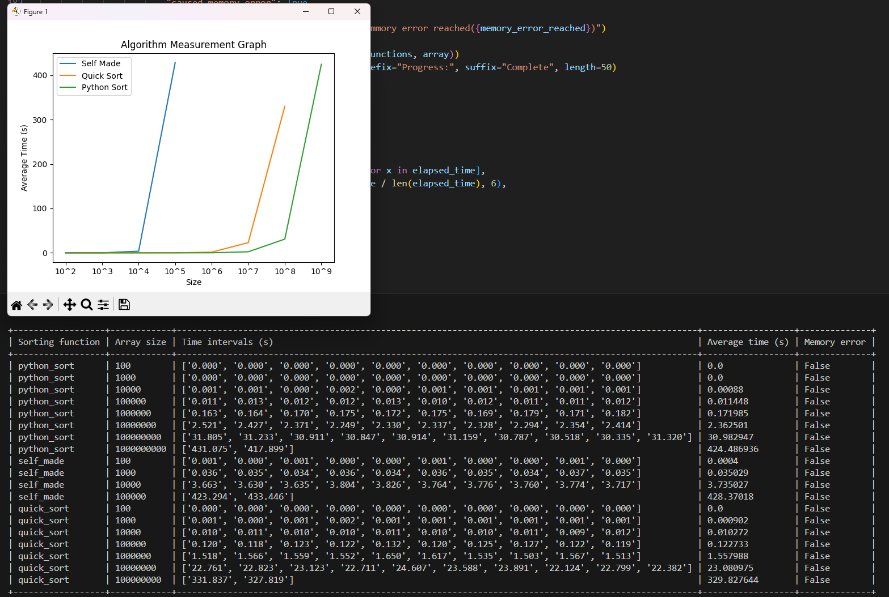
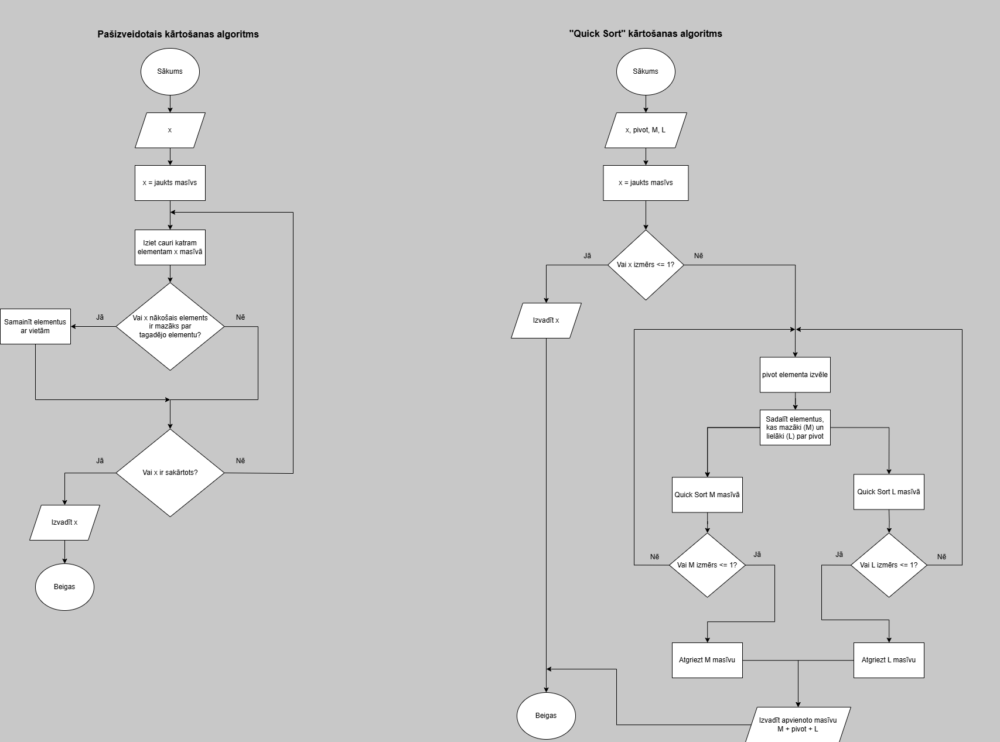
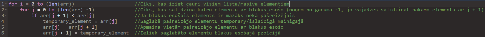
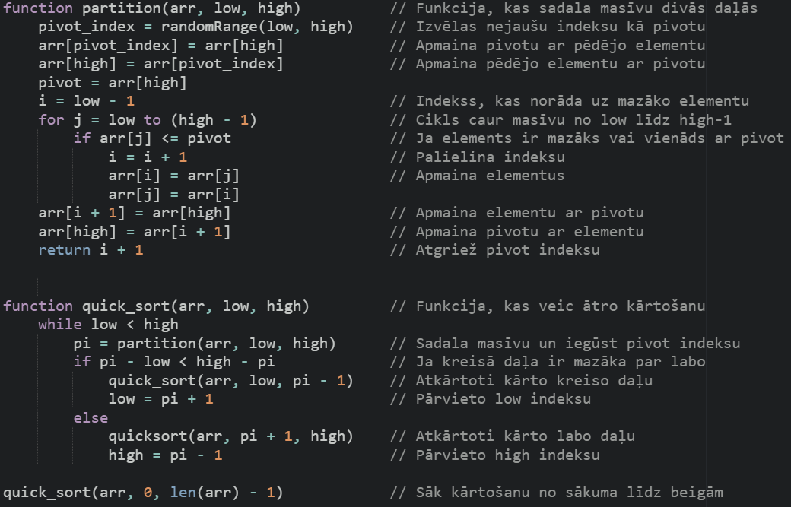

# 2024-10_Python_comparing-sorting-algorithms

## Overview
This group project focused on comparing the performance of three different sorting algorithms. We tested the algorithms on arrays of varying sizes to analyze their efficiency and behavior under different conditions.
Although it was a team effort, I contributed the majority of the coding work, due to my prior programming experience.

## Features
- User configurable settings to run sorting algorithm tests under desired conditions
- Loading bar for progress
- Table, that contains all data
- Graph, that visually displays gathered data
- Memory overload protection that stops the sorting process and outputs the data collected so far
- The algorithm tracks only 2 measuring results, if it takes longer than two minutes, and stops further measuring

## How to Run
1. Make sure these dependencies are installed:#

```pip install terminaltables
   pip install matplotlib
   pip install numpy
   ```

2. Run the file using any Python compatible compiler or interpreter.

## Additional Materials
- [Project Presentation (PDF)](additional_materials/project_presentation.pdf)
- [Algorithm complexity (XLSX)](additional_materials/algorithm_complexity.xlsx)

---
## Pictures related to this project





